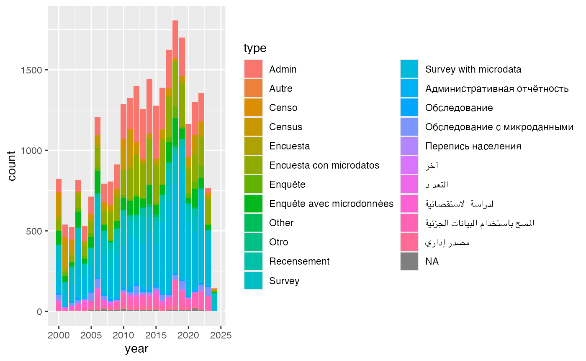
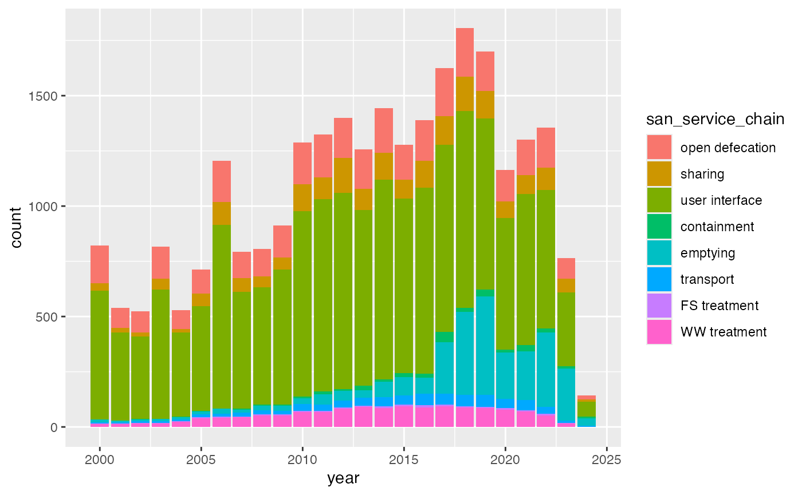
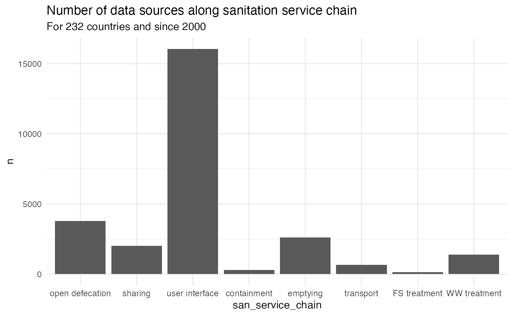
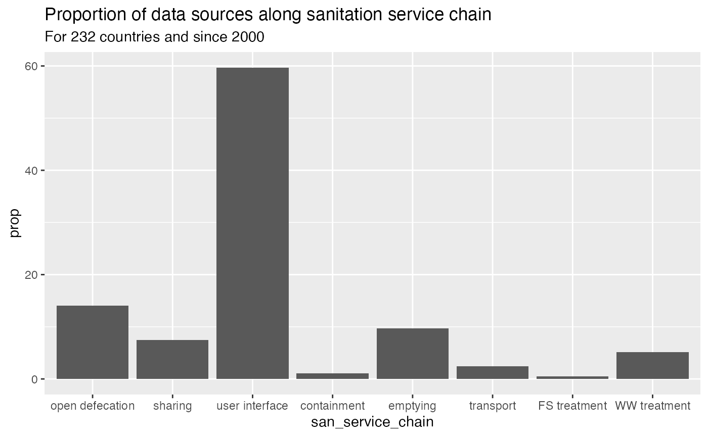
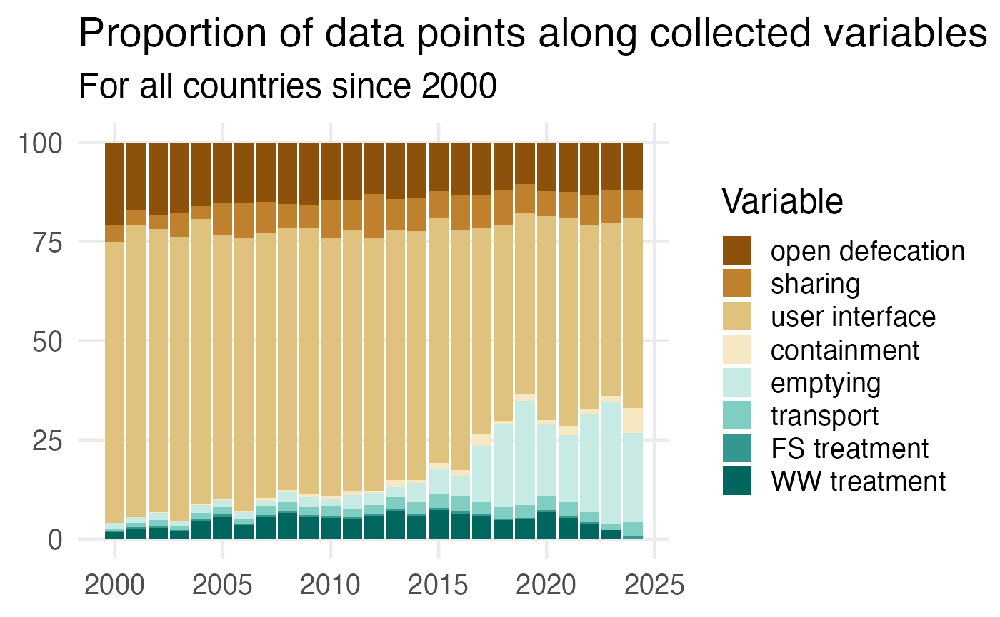
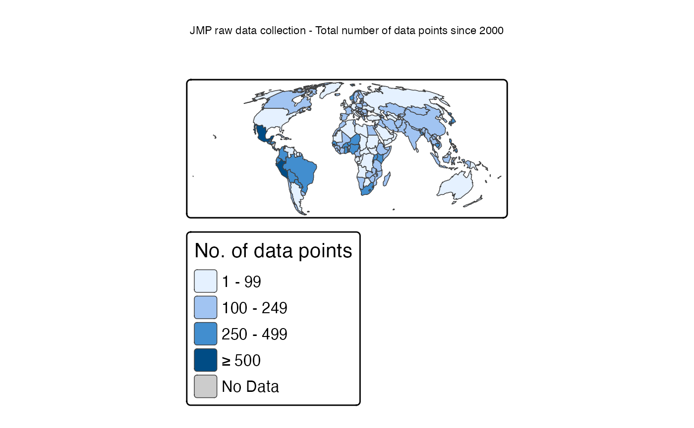
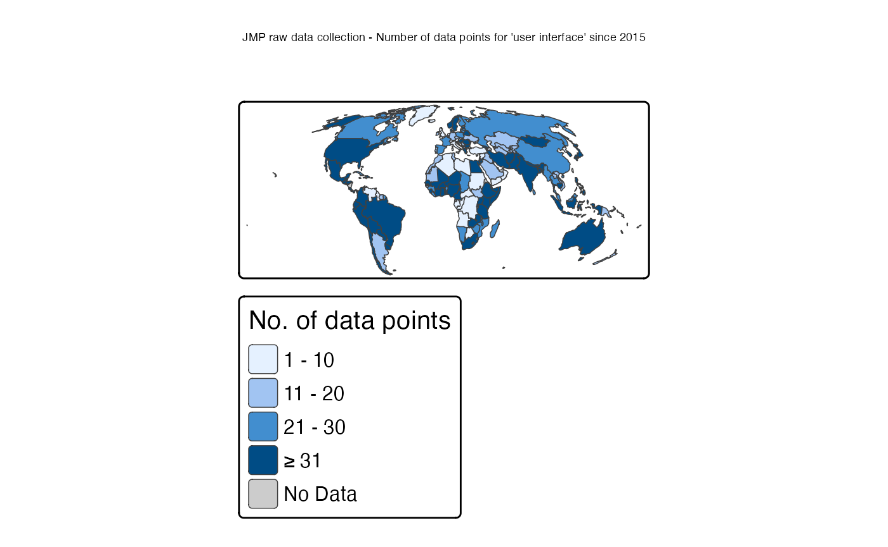
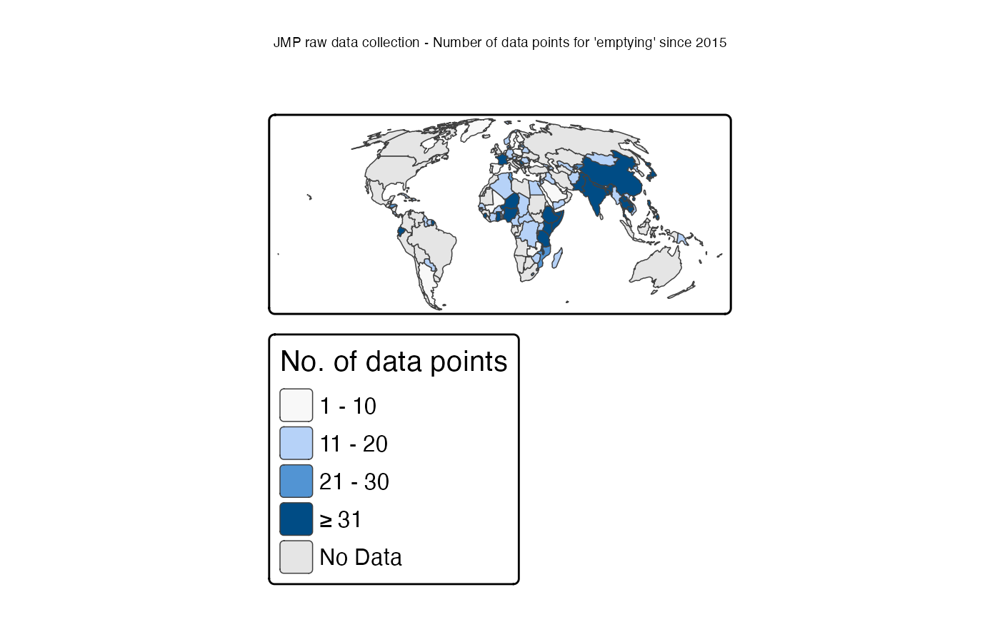
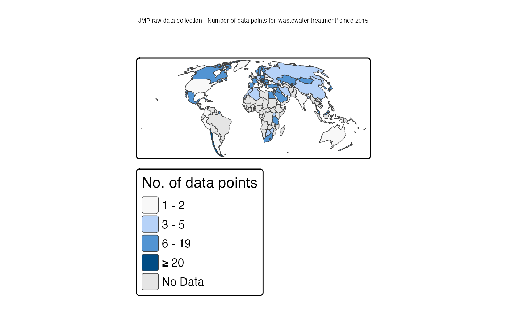
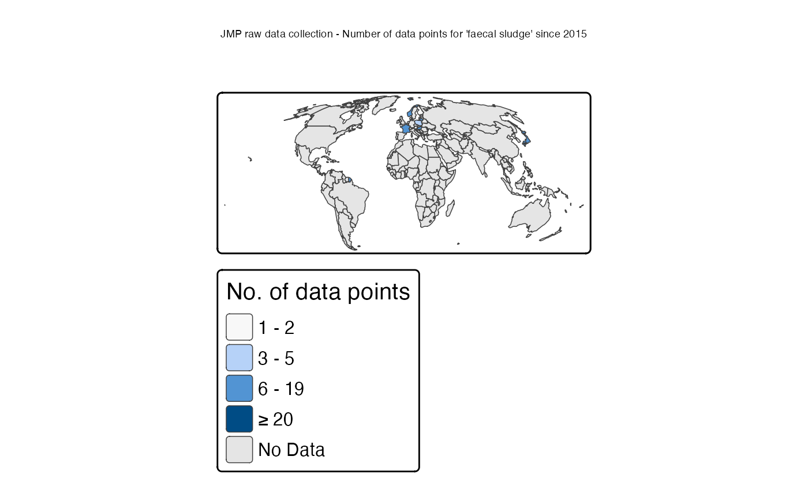

# JMP raw data visualisations

## Explore data

Datasets included in the JMP database include:

- Censuses, which in principle collect basic data from all people living
  within a country. Censuses are always led by national statistical
  offices.
- Household surveys, which collect data from a subset of households.
  These may target national, rural, or urban populations, or more
  limited project or sub-national areas. An appropriate sample design is
  necessary for survey results to be representative, and surveys are
  often led by or reviewed and approved by national statistical
  organizations.
- Administrative data, may consist of information collected by
  government or non-government entities involved in the delivery or
  oversight of services. Examples include: water and sanitation
  inventories and databases, and reports of regulators.
- Other datasets may be available such as compilations by international
  or regional initiatives (e.g. IB-NET), studies conducted by research
  institutes, or technical advice received during country consultations.

``` r

## 5 NAs are countries without data

jmpraw %>%
    count(type)
```

    ## # A tibble: 23 × 2
    ##    type                          n
    ##    <chr>                     <int>
    ##  1 Admin                      4371
    ##  2 Autre                         4
    ##  3 Censo                       316
    ##  4 Census                     1311
    ##  5 Encuesta                    355
    ##  6 Encuesta con microdatos    3863
    ##  7 Enquête                     485
    ##  8 Enquête avec microdonnées  1700
    ##  9 Other                       148
    ## 10 Otro                          3
    ## # ℹ 13 more rows

``` r

jmpraw %>%
    count(type, source) %>%
    arrange(desc(n))
```

    ## # A tibble: 631 × 3
    ##    type                      source     n
    ##    <chr>                     <chr>  <int>
    ##  1 Survey with microdata     MICS    1712
    ##  2 Admin                     ES      1704
    ##  3 Survey with microdata     DHS     1309
    ##  4 Census                    CEN     1254
    ##  5 Recensement               CEN      691
    ##  6 Enquête avec microdonnées DHS      528
    ##  7 Admin                     EUSILC   478
    ##  8 Enquête avec microdonnées MICS     386
    ##  9 Encuesta con microdatos   ENAHO    370
    ## 10 Survey with microdata     PMA      351
    ## # ℹ 621 more rows

``` r

jmpraw %>%
    count(san_service_chain)
```

    ## # A tibble: 8 × 2
    ##   san_service_chain     n
    ##   <fct>             <int>
    ## 1 open defecation    3770
    ## 2 sharing            2008
    ## 3 user interface    16055
    ## 4 containment         295
    ## 5 emptying           2601
    ## 6 transport           664
    ## 7 FS treatment        125
    ## 8 WW treatment       1375

``` r

jmpraw %>%
    ggplot(aes(x = year, fill = type)) +
    geom_bar()
```



``` r

jmpraw %>%
    ggplot(aes(x = year, fill = san_service_chain)) +
    geom_bar()
```



``` r

jmpraw %>%
    filter(!is.na(san_service_chain)) %>%
    group_by(san_service_chain) %>%
    count() %>%
    ggplot(aes(x = san_service_chain, y = n)) +
    geom_col() +
    labs(
        title = "Number of data sources along sanitation service chain",
        subtitle = "For 232 countries and since 2000"
    ) +
    theme_minimal()
```



``` r

jmpraw %>%
    filter(!is.na(san_service_chain)) %>%
    count(san_service_chain) %>%
    mutate(
        prop = n / sum(n) * 100
    ) %>%

    ggplot(aes(x = san_service_chain, y = prop)) +
    geom_col() +
    labs(
        title = "Proportion of data sources along sanitation service chain",
        subtitle = "For 232 countries and since 2000"
    )
```



``` r

jmpraw %>%
    filter(!is.na(san_service_chain)) %>%
    count(year, san_service_chain) %>%
    group_by(year) %>%
    mutate(
        prop = n / sum(n) * 100
    ) %>%

    ggplot(aes(x = year, y = prop, fill = san_service_chain)) +
    geom_col() +
    labs(
        x = NULL,
        y = NULL,
        title = "Proportion of data points along collected variables",
        subtitle = "For all countries since 2000",
        fill = "Variable"
    ) +
    scale_fill_brewer(palette = "BrBG") +
    theme_minimal(base_size = 18) +
    theme(panel.grid.minor = element_blank())
```



``` r

jmp_iso3_frequency <- jmpraw %>%
    count(iso3)

jmp_iso3_user_interface_2015 <- jmpraw %>%
    filter(year >= 2015) %>%
    filter(san_service_chain == "user interface") %>%
    count(iso3, san_service_chain)

jmp_iso3_emptying_2015 <- jmpraw %>%
    filter(year >= 2015) %>%
    filter(san_service_chain == "emptying") %>%
    count(iso3, san_service_chain)

jmp_iso3_ww_treatment_2015 <- jmpraw %>%
    filter(year >= 2015) %>%
    filter(san_service_chain == "WW treatment") %>%
    count(iso3, san_service_chain)

jmp_iso3_fs_treatment_2015 <- jmpraw %>%
    filter(year >= 2015) %>%
    filter(san_service_chain == "FS treatment") %>%
    count(iso3, san_service_chain)
```

## Maps

``` r

## prepare world maps
## https://r-tmap.github.io/tmap/articles/basics_modes

data("World")
world_moll = st_transform(World, crs = "+proj=moll")

tmap_mode("plot")
```

### All data points since 2000

``` r

world_moll %>%
    left_join(jmp_iso3_frequency, by = c("iso_a3" = "iso3")) %>%
    filter(continent != "Antarctica") %>%
    tm_shape() +
    tm_polygons(
        fill = "n",
        fill.scale = tm_scale_intervals(
            breaks = c(1, 100, 250, 500, Inf),
            values.range = c(0.1, 0.9),
            value.na = "grey80",
            label.na = "No Data"
        ),
        fill.legend = tm_legend(title = "No. of data points"),
        lwd = 0.5
    ) +
    tm_title("JMP raw data collection - Total number of data points since 2000") +
    tm_layout(scale = 1.5)
```



``` r

top10(jmp_iso3_frequency)
```

    ## # A tibble: 10 × 2
    ##    country          n
    ##    <chr>        <int>
    ##  1 Mexico         617
    ##  2 Peru           577
    ##  3 Colombia       462
    ##  4 Nigeria        462
    ##  5 South Africa   383
    ##  6 Cambodia       382
    ##  7 Costa Rica     366
    ##  8 Uganda         363
    ##  9 Ecuador        335
    ## 10 Bangladesh     332

### Data points for user interface since 2015

``` r

world_moll %>%
    left_join(jmp_iso3_user_interface_2015, by = c("iso_a3" = "iso3")) %>%
    filter(continent != "Antarctica") %>%
    tm_shape() +
    tm_polygons(
        fill = "n",
        fill.scale = tm_scale_intervals(
            breaks = c(1, 11, 21, 31, Inf),
            values.range = c(0.1, 0.9),
            value.na = "grey80",
            label.na = "No Data"
        ),
        fill.legend = tm_legend(title = "No. of data points"),
        lwd = 0.5
    ) +
    tm_title("JMP raw data collection - Number of data points for 'user interface' since 2015") +
    tm_layout(scale = 1.5)
```



``` r

top10(jmp_iso3_user_interface_2015)
```

    ## # A tibble: 10 × 2
    ##    country       n
    ##    <chr>     <int>
    ##  1 Mexico      223
    ##  2 Peru        220
    ##  3 Colombia    160
    ##  4 Kenya       124
    ##  5 Nigeria     120
    ##  6 Uganda      114
    ##  7 Niger       106
    ##  8 Ecuador     104
    ##  9 Guatemala    96
    ## 10 Cambodia     94

### Data points for emptying since 2015

``` r

world_moll %>%
    left_join(jmp_iso3_emptying_2015, by = c("iso_a3" = "iso3")) %>%
    filter(continent != "Antarctica") %>%
    tm_shape() +
    tm_polygons(
        fill = "n",
        fill.scale = tm_scale_intervals(
            breaks = c(1, 11, 21, 31, Inf),
            values.range = c(0.1, 1),
            value.na = "grey90",
            label.na = "No Data"
        ),
        fill.legend = tm_legend(title = "No. of data points"),
        lwd = 0.5
    ) +
    tm_title("JMP raw data collection - Number of data points for 'emptying' since 2015") +
    tm_layout(scale = 1.5)
```



``` r

top10(jmp_iso3_emptying_2015)
```

    ## # A tibble: 10 × 2
    ##    country         n
    ##    <chr>       <int>
    ##  1 Nigeria       112
    ##  2 Philippines    94
    ##  3 Cambodia       92
    ##  4 Niger          72
    ##  5 Japan          62
    ##  6 Bangladesh     40
    ##  7 Ecuador        40
    ##  8 Kenya          40
    ##  9 Samoa          40
    ## 10 Nepal          34

### Data points for wastewater treatment since 2015

``` r

world_moll %>%
    left_join(jmp_iso3_ww_treatment_2015, by = c("iso_a3" = "iso3")) %>%
    filter(continent != "Antarctica") %>%
    tm_shape() +
    tm_polygons(
        fill = "n",
        fill.scale = tm_scale_intervals(
            breaks = c(1, 3, 6, 20, Inf),
            values.range = c(0.1, 1),
            value.na = "grey90",
            label.na = "No Data"
        ),
        fill.legend = tm_legend(title = "No. of data points"),
        lwd = 0.5
    ) +
    tm_title("JMP raw data collection - Number of data points for 'wastewater treatment' since 2015") +
    tm_layout(scale = 1.5)
```



``` r

top10(jmp_iso3_ww_treatment_2015)
```

    ## # A tibble: 10 × 2
    ##    country                 n
    ##    <chr>               <int>
    ##  1 Chile                  22
    ##  2 Hungary                20
    ##  3 Mauritius              17
    ##  4 Hong Kong SAR China    16
    ##  5 Macao SAR China        16
    ##  6 South Korea            15
    ##  7 Czechia                14
    ##  8 Georgia                12
    ##  9 Norway                 11
    ## 10 Saudi Arabia           11

### Data points for faecal sludge treatment since 2015

``` r

world_moll %>%
    left_join(jmp_iso3_fs_treatment_2015, by = c("iso_a3" = "iso3")) %>%
    filter(continent != "Antarctica") %>%
    tm_shape() +
    tm_polygons(
        fill = "n",
        fill.scale = tm_scale_intervals(
            breaks = c(1, 3, 6, 20, Inf),
            values.range = c(0.1, 1),
            value.na = "grey90",
            label.na = "No Data"
        ),
        fill.legend = tm_legend(title = "No. of data points"),
        lwd = 0.5
    ) +
    tm_title("JMP raw data collection - Number of data points for 'faecal sludge' since 2015") +
    tm_layout(scale = 1.5)
```



``` r

top10(jmp_iso3_fs_treatment_2015)
```

    ## # A tibble: 10 × 2
    ##    country       n
    ##    <chr>     <int>
    ##  1 Hungary       9
    ##  2 Lithuania     9
    ##  3 France        8
    ##  4 Japan         8
    ##  5 Malta         8
    ##  6 Norway        8
    ##  7 Poland        3
    ##  8 Nepal         2
    ##  9 Austria       1
    ## 10 Finland       1
